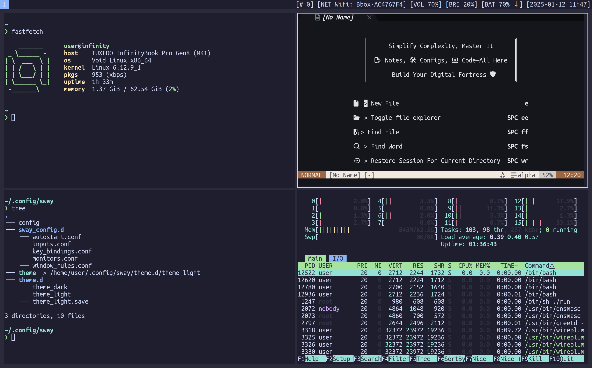
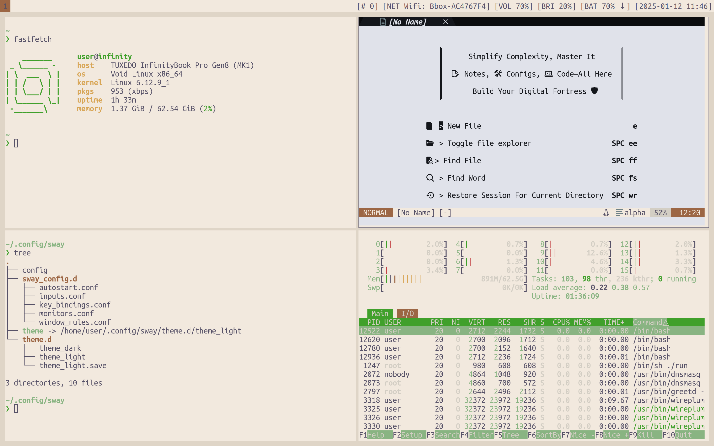

# Void Linux (glibc) Dotfiles — Sway Window Manager 🖥️

Dotfiles optimizados, elegantes y modernos para **Void Linux (glibc)** con el gestor de ventanas Wayland **Sway**.

Incluye temas dinámicos (Claro / Oscuro), barra de estado personalizada, menú de energía integrado, soporte completo para teclado en español/latinoamericano/US, atajos intuitivos y un instalador interactivo amigable.

---

## 📸 Capturas de Pantalla

| Modo Oscuro (Catppuccin Mocha) | Modo Claro (Warm Paper) |
| :---: | :---: |
|  |  |

---

## ⚡ Características Principales

- **Distro Base**: [Void Linux](https://voidlinux.org/) (glibc / musl compatible).
- **Compositor Wayland**: Sway (modular y eficiente).
- **Terminal**: Alacritty con fuente *UbuntuMono Nerd Font* / *JetBrainsMono*.
- **Lanzador de Aplicaciones**: Fuzzel (rápido, estético y ligero).
- **Barra de Estado**: `swaybar` dinámico con detección automática de:
  - Batería multinivel y estado de carga.
  - Volumen de audio (PipeWire / WirePlumber / PulseAudio).
  - Red (WiFi SSID con NetworkManager o wpa_cli, o Ethernet).
  - Brillo de pantalla (brightnessctl).
  - Uso de memoria RAM en tiempo real.
  - Contador de ventanas en el Scratchpad.
- **Editor**: Neovim con Lazy.nvim, Mason (soporte completo en glibc), LSP, Treesitter y Lualine.
- **Gestión de Temas Dinámica**: Script `switch` para alternar entre temas claro y oscuro al instante (`Super + Shift + T` o automáticamente por hora).
- **Menú de Energía**: `power_menu.sh` integrado para suspender, reiniciar, apagar, bloquear o cerrar sesión.
- **Capturas de Pantalla**: `grim` + `slurp` + `wl-copy` con guardado automático y copia al portapapeles.

---

## 🚀 Instalación Rápida

Para instalar y configurar todo automáticamente en tu sistema Void Linux:

```bash
# 1. Clonar este repositorio
git clone https://github.com/Darrkhan/VoidLinux-dotfiles.git dofilevoid
cd dofilevoid

# 2. Ejecutar el instalador interactivo
./install.sh
```

### ¿Qué hace el instalador (`install.sh`)?
1. **Comprueba el sistema**: Verifica Void Linux y la arquitectura glibc.
2. **Instala paquetes vía `xbps-install`**: Sway, Pipewire, Wireplumber, Fuzzel, Alacritty, Neovim, fuentes Nerd, etc.
3. **Configura permisos de usuario**: Agrega tu usuario a los grupos `_seatd`, `video`, `audio`, `input` y `wheel`.
4. **Habilita servicios de Runit**: Activa `dbus`, `seatd`, `polkitd` y `NetworkManager` en `/var/service/`.
5. **Configura el teclado**: Te permite elegir entre Español (`es`), Latinoamérica (`latam`), Inglés (`us`) o combinación multi-layout.
6. **Despliega los dotfiles**: Respalda cualquier configuración previa existente en `~/.config/dotfiles_backup_*` y despliega los nuevos archivos.
7. **Configura el entorno Wayland**: Agrega las variables `XDG_CURRENT_DESKTOP=sway`, `MOZ_ENABLE_WAYLAND=1`, y añade `~/.local/bin` a tu `$PATH`.

---

## ⌨️ Atajos de Teclado (Cheat Sheet)

La tecla modificadora principal (**`$mod`**) es la tecla **Super** (Windows).

### Aplicaciones y Sistema
| Atajo | Acción |
| :--- | :--- |
| **`Super + Enter`** | Abrir terminal (**Alacritty**) |
| **`Super + Q`** | Cerrar ventana enfocada |
| **`Super + D`** | Lanzador de aplicaciones (**Fuzzel**) |
| **`Super + B`** | Navegador Web (**Firefox**) |
| **`Super + F`** | Explorador de archivos en terminal (**nnn**) |
| **`Super + T`** | Multiplexor de terminal (**tmux**) |
| **`Super + Shift + T`** | Alternar tema Claro / Oscuro (**switch toggle**) |
| **`Super + Shift + X`** / **`Super + Esc`** | Menú de energía y sesión (**Power Menu**) |
| **`Super + Shift + C`** | Recargar configuración de Sway |
| **`Super + Shift + E`** | Salir de Sway (cerrar sesión) |

### Capturas de Pantalla
| Atajo | Acción |
| :--- | :--- |
| **`Super + Shift + S`** o **`Shift + Alt + P`** | Seleccionar área y guardar + copiar al portapapeles |
| **`Print`** | Captura de pantalla completa |

### Gestión de Ventanas y Navegación
| Atajo | Acción |
| :--- | :--- |
| **`Super + H / J / K / L`** o Flechas | Mover foco de ventana (izquierda, abajo, arriba, derecha) |
| **`Super + Shift + H / J / K / L`** | Mover ventana de posición |
| **`Super + Shift + Espacio`** | Alternar ventana flotante / tiling |
| **`Super + M`** | Alternar pantalla completa (fullscreen) |
| **`Super + N`** / **`Super + V`** | Dividir espacio horizontal / vertical |
| **`Super + S`** / **`Super + W`** / **`Super + E`** | Modo apilado (stacking) / pestañas (tabbed) / toggle split |
| **`Super + Shift + -`** | Enviar ventana al **Scratchpad** |
| **`Super + -`** | Mostrar / ocultar ventana del **Scratchpad** |

### Espacios de Trabajo (Workspaces)
| Atajo | Acción |
| :--- | :--- |
| **`Super + 1 .. 9, 0`** | Cambiar a los espacios de trabajo 1 al 10 |
| **`Super + Shift + 1 .. 9, 0`** | Mover ventana enfocada al espacio 1 al 10 |

---

## 🎨 Personalización de Temas

El script `switch` te permite cambiar el tema de Sway, Alacritty, Fuzzel y el fondo de pantalla en cualquier momento:

```bash
# Cambiar a tema oscuro
switch dark

# Cambiar a tema claro
switch light

# Alternar entre oscuro y claro
switch toggle

# Modo automático (claro de 7:00 a 19:00, oscuro de noche)
switch auto
```

---

## 🛠️ Estructura del Repositorio

```text
├── install.sh                  # Script interactivo de instalación y configuración
├── switch                      # Gestor de temas claro / oscuro
├── swaybar.sh                  # Generador de barra de estado
├── power_menu.sh               # Menú de apagado y sesión
├── sway/
│   ├── config                  # Archivo principal de Sway
│   ├── theme                   # Tema activo (symlink)
│   ├── theme.d/                # Definiciones de colores claro y oscuro
│   └── sway_config.d/          # Módulos organizados de Sway
│       ├── autostart.conf      # Daemons de inicio (Pipewire, Mako, etc.)
│       ├── inputs.conf         # Teclado y touchpad
│       ├── key_bindings.conf   # Atajos de teclado
│       ├── monitors.conf       # Configuración de pantallas
│       └── window_rules.conf   # Reglas de ventanas y flotantes
├── alacritty/                  # Configuraciones de Alacritty y temas
├── fuzzel/                     # Configuraciones de Fuzzel (dark/light)
├── fastfetch/                  # Configuración de Fastfetch
└── nvim/                       # Configuración completa de Neovim con Lazy y Mason
```

---

## 💡 Consejos de Uso en Void Linux

1. **Iniciar sesión en Sway**:
   En Void Linux sin gestor de pantalla (Display Manager), simplemente inicia sesión en tu tty y escribe:
   ```bash
   sway
   ```
2. **Audio con Pipewire**:
   Los demonios de Pipewire y Wireplumber se inician automáticamente al arrancar Sway mediante `autostart.conf`.
3. **Permisos de asiento (Seat)**:
   Asegúrate de que el servicio `seatd` esté corriendo (`/var/service/seatd`) y que tu usuario esté en el grupo `_seatd` y `video`.
